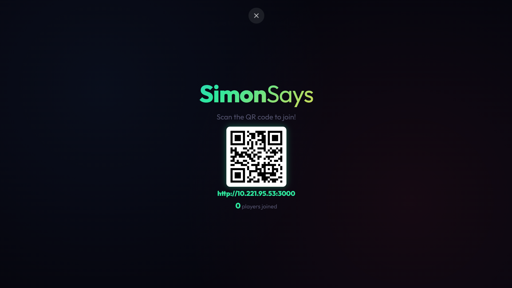
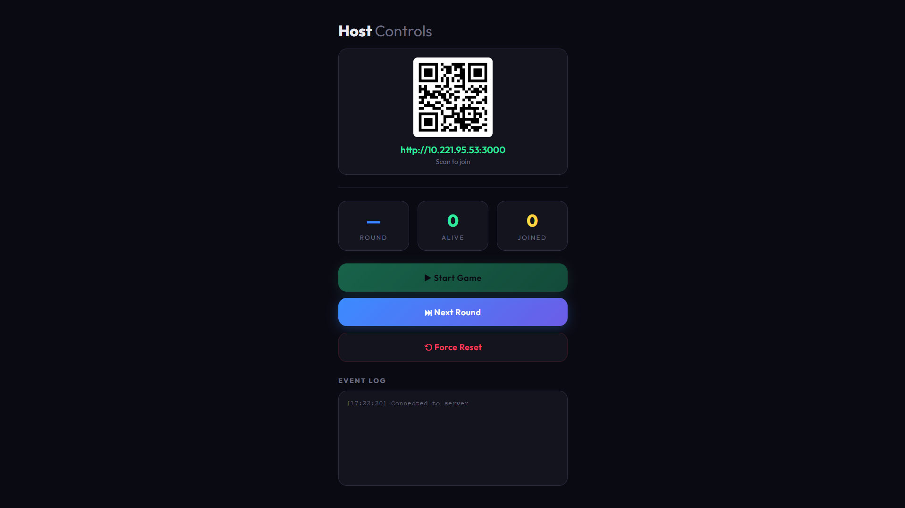

<div align="center">
  <h1>Simon Says Multiplayer</h1>
  <p>A real-time, massively multiplayer take on the classic memory game, built for college fests and large gatherings.</p>

  <p>
    
    
    
    
    
  </p>
</div>

---

## About the Game

In **Simon Says Multiplayer**, players compete in a fast-paced memory challenge:
1. **Watch the Screen:** The main projector displays a sequence of colors that flashes one by one. Each round, a new color is added to the sequence.
2. **Memorize & Tap:** Once the sequence finishes playing, players have a limited time to replicate the exact sequence by tapping the color pads on their phones.
3. **Survive or Spectate:** One wrong tap or failing to finish within the time limit results in instant elimination. Eliminated players are moved to a Spectator screen to watch the remaining players fight for the crown.
4. **Last One Standing:** The rounds get progressively harder (longer sequences) until only one player survives to be crowned the ultimate champion!

## Screenshots

*(Replace these placeholders with actual screenshots of your game before presenting!)*

<div align="center">
  
  <p><i>The Big Screen Display (Projector View)</i></p>
</div>

<br/>

<div align="center">
  
  &nbsp;&nbsp;&nbsp;&nbsp;
  
  &nbsp;&nbsp;&nbsp;&nbsp;
  
</div>
<div align="center">
  <p><i>Left to Right: Player Controller, Spectator View, Host Dashboard</i></p>
</div>

## Features

- **Massively Multiplayer:** Supports 30+ simultaneous players connected via mobile devices.
- **Dynamic QR Code:** Auto-detects local IP and generates a QR code on the Display & Host screens for instant, frictionless joining.
- **Zero-Lag Gameplay:** Optimized for local network (LAN/WiFi) environments to ensure millisecond-perfect timing.
- **Spectator Mode:** Eliminated players seamlessly transition into spectators, watching live survivor counts.
- **Host Dashboard:** A dedicated control panel for the event host to start games, progress rounds, and force-reset the lobby.
- **Audio & Visual Polish:** Integrated sound effects for tapping, eliminations, and victories, alongside an HTML5 Canvas confetti celebration!
- **Simulated Load Testing:** Comes with a built-in `simulate.js` script to instantly test the server with 30 AI bots.

## Why Run Locally (LAN) vs Cloud?

This game was specifically engineered to be played on a local network (using a dedicated WiFi router without internet) for college fests and large events. Here's why:

- **Zero Lag (Latency):** Simon Says is a timing-based game. Cloud deployments (like Heroku or Render) rely on the venue's often congested mobile networks (4G/5G). A local router guarantees millisecond-perfect Socket.io events, meaning players never miss a tap due to lag.
- **No Internet Required:** Fests usually have terrible cell reception due to crowds. Since the server runs on your laptop and players connect via a local router, the entire game works perfectly completely offline!
- **Zero Friction:** Users just connect to the open event WiFi, scan the projector's QR code, and instantly start playing—no downloading apps or wrestling with slow data connections.

## Tech Stack

- **Backend:** Node.js, Express.js
- **Real-Time Communication:** Socket.io
- **Frontend:** Vanilla HTML, CSS, JavaScript (No frameworks, lightweight for fast mobile loading)
- **Utilities:** `qrcode` (for on-the-fly QR generation)

## Getting Started

### Prerequisites
- [Node.js](https://nodejs.org/) (v16 or higher)
- npm (Node Package Manager)
- A dedicated WiFi router (highly recommended for events with 20+ people)

### Installation

1. Clone the repository:
   ```bash
   git clone https://github.com/Mohit-07-delta/SimonSays.git
   cd SimonSays
   ```

2. Install dependencies:
   ```bash
   npm install
   ```

3. Start the server:
   ```bash
   npm start
   ```

### How to Play (Event Setup)

1. Connect the host laptop to your dedicated WiFi Router.
2. Run `npm start`.
3. Open the **Display Screen** (`http://localhost:3000/display`) on a projector or large monitor.
4. Open the **Host Dashboard** (`http://localhost:3000/host`) on the laptop.
5. Ask players to connect to the WiFi Router on their phones, then scan the QR code shown on the projector.
6. Once enough players join, the Host hits **Start Game**!

## Load Testing

Want to test how the game handles a crowd before the actual event?
Open a new terminal window and run:

```bash
node simulate.js
```

This will automatically connect 30 bots to the server who will play the game intelligently (making occasional mistakes so you can test eliminations).

## Project Structure

```text
SimonSays
 ┣ public/
 ┃ ┣ display.html / .css / .js   # Projector Screen
 ┃ ┣ host.html / .css / .js      # Host Dashboard
 ┃ ┣ player.html / .css / .js    # Mobile Controller
 ┃ ┗ tap.mp3, win.mp3...         # Audio Assets (Add your own)
 ┣ server.js                     # Main Express & Socket.io Server
 ┣ simulate.js                   # Load testing bot script
 ┣ package.json
 ┗ README.md
```

---
<div align="center">
  <p>Made for college fests and tech events.</p>
</div>
